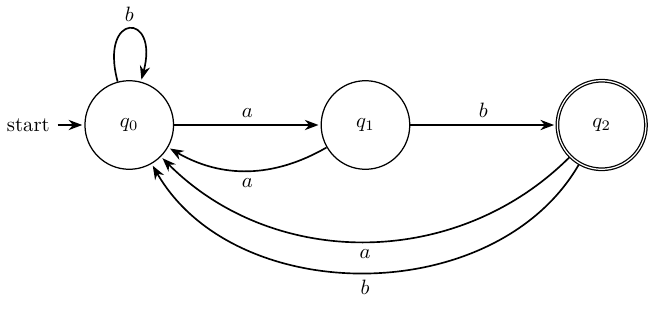
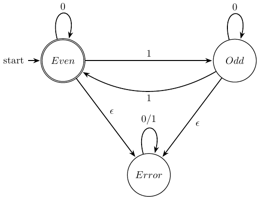

# Finite State Machine Designer


## :brain: Overview

This project provides a comprehensive C library for creating, manipulating, and visualizing Finite State Machines (FSMs). 
The core idea is to enable developers to programmatically define FSMs using a clean C API and automatically generate professional-quality diagrams in LaTeX format using the TikZ package.

## :sparkles: Key Features

- **Intuitive C API**: Simple and clean functions for creating FSMs, adding vertices (states), and defining edges (transitions)
- **Memory Safety**: Integrated with a custom safe string library to prevent buffer overflows and memory leaks
- **LaTeX Generation**: Automatic generation of LaTeX code with TikZ for professional FSM visualization
- **PDF and PNG Output**: Generates both PDF documents and PNG images for easy sharing and embedding
- **Greek Letter Support**: Built-in support for Greek letters ($\alpha$, $\beta$, $\gamma$, etc...) commonly used in theoretical computer science
- **Flexible Styling**: Support for curved edges, self-loops, and customizable vertex positioning
- **Modular Design**: Well-structured codebase with separate core library and example implementations

## :rocket: Get Started

### :memo: Requirements

Before using this project, ensure you have the following tools installed:

- **C Compiler**: GCC or Clang
- **CMake**: Version 3.10 or higher
- **LaTeX Distribution**: TeX Live (Linux/macOS) or MiKTeX (Windows) with TikZ package
- **Make**: GNU Make for building LaTeX documents
- **pdftoppm**: Part of poppler-utils for PNG generation

### Clone the repository

To get started with the Finite State Machine Designer, follow these steps to clone the repository and build the main library:

```bash
git clone https://github.com/AntonioBerna/fsm.git
cd fsm
```

### Running Examples

The project includes several example programs that demonstrate different FSM use cases:

#### Example 1: Recognizing Strings Ending with "ab"

You can build and run the example that recognizes strings ending with the pattern "ab" as follows:

```bash
cd examples/recognize-strings-ending-with-ab
./build.sh
```

After running the build script, you will find the following files generated:

- `latex/recognize-strings-ending-with-ab.pdf`: The FSM diagram as a PDF
- `latex/recognize-strings-ending-with-ab-1.png`: The FSM diagram as a PNG image

<p align="center">
    
</p>

#### Example 2: Counting Even Number of Ones

You can build and run the example that counts an even number of $1$ characters in binary strings as follows:

```bash
cd examples/even-number-of-ones
./build.sh
```

After running the build script, you will find the following files generated:

- `latex/even-number-of-ones.pdf`: The FSM diagram as a PDF
- `latex/even-number-of-ones-1.png`: The FSM diagram as a PNG image

<p align="center">
    
</p>

### Creating Your Own FSM

If you want to create your own FSM, you can create a new directory under `examples/` and follow the structure of the existing examples.

In particular, you will need to:

1. Create a `build.sh` script that sets up the CMake project (you can copy an existing one).
2. Define your FSM in a C source file, using the provided API to create vertices and edges.
3. Edit the `CMakeLists.txt` file to include your source files and link against the FSM library.

### Cleaning Up

To clean build artifacts and generated files:

```bash
# Clean a specific example
cd examples/recognize-strings-ending-with-ab
./build.sh clean

# Or manually remove build directories
rm -rf build latex
```
