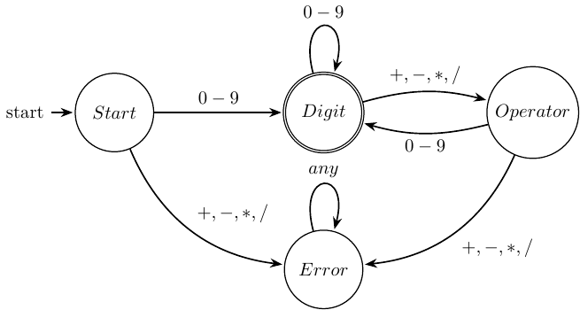

# fsm


## :brain: Overview

This project provides a comprehensive C library for creating, manipulating, and visualizing Finite State Machines (FSMs). 
The core idea is to enable developers to programmatically define FSMs using a clean C API and automatically generate professional-quality diagrams in LaTeX format using the TikZ package.

## :sparkles: Key Features

- **Intuitive C API**: Simple and clean functions for creating FSMs, adding vertices (states), and defining edges (transitions)
- **Memory Safety**: Integrated with a custom safe string library to prevent buffer overflows and memory leaks
- **LaTeX Generation**: Automatic generation of LaTeX code with TikZ for professional FSM visualization
- **PDF and PNG Output**: Generates both PDF documents and PNG images for easy sharing and embedding
- **Greek Letter Support**: Built-in support for Greek letters ($\alpha$, $\beta$, $\gamma$, etc...) commonly used in theoretical computer science
- **Flexible Styling**: Support for curved edges, self-loops, and customizable vertex positioning
- **Modular Design**: Well-structured codebase with separate core library and example implementations

## :memo: Requirements

Before using this project, ensure you have the following tools installed:

- **C Compiler**: GCC or Clang
- **CMake**: Version 3.10 or higher
- **LaTeX Distribution**: TeX Live (Linux/macOS) or MiKTeX (Windows) with TikZ package
- **Make**: GNU Make for building LaTeX documents
- **pdftoppm**: Part of poppler-utils for PNG generation

## :rocket: Get Started

To get started with the Finite State Machine Designer, you need to clone the repository using the following command:

```bash
git clone https://github.com/AntonioBerna/fsm.git
cd fsm
```

### Running Examples

The project includes several example programs that demonstrate different FSM use cases:

#### Example 1: Recognizing Strings Ending with "ab"

You can build and run the example that recognizes strings ending with the pattern "ab" as follows:

```bash
cd examples/recognize-strings-ending-with-ab
./build.sh
```

After running the build script, you will find the following files generated:

- `latex/recognize-strings-ending-with-ab.pdf`: The FSM diagram as a PDF
- `latex/recognize-strings-ending-with-ab-1.png`: The FSM diagram as a PNG image

<p align="center">
    
</p>

#### Example 2: Counting Even Number of Ones

You can build and run the example that counts an even number of $1$ characters in binary strings as follows:

```bash
cd examples/even-number-of-ones
./build.sh
```

After running the build script, you will find the following files generated:

- `latex/even-number-of-ones.pdf`: The FSM diagram as a PDF
- `latex/even-number-of-ones-1.png`: The FSM diagram as a PNG image

<p align="center">
    
</p>

### Creating Your Own FSM

If you want to create your own FSM, you can create a new directory under `examples/` and follow the structure of the existing examples. This section provides a comprehensive guide with a complete step-by-step example.

Each FSM example follows this standard structure:

```
examples/your-fsm-name/
├── main.c           # Your FSM implementation
├── CMakeLists.txt   # Build configuration
├── build.sh         # Build and compilation script
├── build/           # Generated build files (created by build.sh)
└── latex/           # Generated LaTeX, PDF, and PNG files (created by build.sh)
```

#### Step-by-Step Tutorial: Creating a Simple Calculator FSM

Let's create a complete example that demonstrates how to build an FSM for a simple calculator that accepts valid arithmetic expressions with digits and operators.

1. **Crate the Project Directory**: Create a new directory for your FSM example under `examples/`:

    ```bash
    cd examples
    mkdir simple-calculator
    cd simple-calculator
    ```

2. **Create the `main.c` File**: The following code implements a simple FSM that validates arithmetic expressions like "1+2", "5*3-1", etc. It rejects invalid expressions such as "+1", "1+", or "1++2". Here's a complete example:

    ```c
    /**
     * @file main.c
     * @brief Simple Calculator FSM Example
     * @author Antonio Bernardini
     * @date 2025
     * 
     * This FSM validates simple arithmetic expressions like:
     * - "1+2"     -> ACCEPTED
     * - "5*3-1"   -> ACCEPTED  
     * - "+1"      -> REJECTED (can't start with operator)
     * - "1+"      -> REJECTED (can't end with operator)
     * - "1++2"    -> REJECTED (consecutive operators)
     */

    #include "fsm.h"

    int main(void) {
        // Create the FSM
        fsm_t *fsm = fsm_create("Simple Calculator Validator");
        if (!fsm) {
            fprintf(stderr, "Failed to create FSM\n");
            return 1;
        }

        printf("Creating Simple Calculator FSM\n");
        printf("Validates arithmetic expressions like '1+2*3'\n\n");

        // Add states with strategic positioning
        int start = fsm_add_vertex(fsm, "Start", 0, 0);
        int digit = fsm_add_vertex(fsm, "Digit", 4, 0);
        int operator = fsm_add_vertex(fsm, "Operator", 8, 0);
        int error = fsm_add_vertex(fsm, "Error", 4, -3);

        // Configure state properties
        fsm_set_vertex_radius(fsm, start, 0.8);
        fsm_set_vertex_radius(fsm, digit, 1.0);
        fsm_set_vertex_radius(fsm, operator, 1.0);
        fsm_set_vertex_radius(fsm, error, 0.8);

        // Set initial and final states
        fsm_set_initial_state(fsm, start);
        fsm_set_final_state(fsm, digit); // Only accept if ending on digit

        // Add transitions
        int e1 = fsm_add_edge(fsm, start, digit, "0-9");
        int e2 = fsm_add_edge(fsm, start, error, "+,-,*,/");
        int e3 = fsm_add_edge(fsm, digit, operator, "+,-,*,/");
        int e4 = fsm_add_edge(fsm, digit, digit, "0-9");
        int e5 = fsm_add_edge(fsm, operator, digit, "0-9");
        int e6 = fsm_add_edge(fsm, operator, error, "+,-,*,/");
        int e7 = fsm_add_edge(fsm, error, error, "any");

        // Unused edges for clarity
        (void)e1;

        // Style the edges for better visualization
        fsm_set_edge_curved(fsm, e2, -30); // Curve start->error
        fsm_set_edge_curved(fsm, e3, 15);  // Curve digit->operator
        fsm_set_edge_curved(fsm, e4, 60);  // Self-loop on digit
        fsm_set_edge_curved(fsm, e5, 15);  // Curve digit->operator
        fsm_set_edge_curved(fsm, e6, 30);  // Curve operator->error
        fsm_set_edge_curved(fsm, e7, 45);  // Self-loop on error

        // Print FSM information
        fsm_print_info(fsm);

        // Generate LaTeX output
        if (fsm_generate_latex(fsm, "simple-calculator.tex") == 0) {
            printf("LaTeX file generated successfully!\n");
        }

        // Preview the generated code
        printf("\nGenerated LaTeX TikZ code:\n");
        printf("==========================\n");
        fsm_print_latex(fsm);

        // Cleanup
        fsm_destroy(fsm);
        return 0;
    }
    ```

3. **Create the `CMakeLists.txt` File**:

    ```cmake
    cmake_minimum_required(VERSION 3.10)
    project(simple_calculator)

    # Set C standard
    set(CMAKE_C_STANDARD 99)
    set(CMAKE_C_STANDARD_REQUIRED ON)

    # Use Clang as the compiler
    set(CMAKE_C_COMPILER clang)

    # Set strict compiler flags
    set(CMAKE_C_FLAGS "${CMAKE_C_FLAGS} -Wall -Wextra -Werror -pedantic")

    # Include directories for FSM and string libraries
    include_directories(../../core)
    include_directories(../../lib/safety/sstring/core)

    # Build the safe strings library
    add_library(sstring STATIC ../../lib/safety/sstring/core/sstring.c)

    # Build the FSM library  
    add_library(fsm_lib STATIC ../../core/fsm.c)
    target_link_libraries(fsm_lib sstring)

    # Build your example executable
    add_executable(simple_calculator main.c)
    target_link_libraries(simple_calculator fsm_lib sstring)
    ```

4. **Create the `build.sh` Script**: The following script is a template for building the example. You rember to replace the `exec_name` variable with the name of your executable:

    ```bash
    #!/bin/bash

    exec_name="simple_calculator"

    set -e  # Exit on any error

    ...
    ```

5. **Make the Script Executable and Run/Clean**:

    ```bash
    chmod +x build.sh

    # To build the example
    ./build.sh

    # To clean the example
    ./build.sh clean

    # Or manually remove build directories
    rm -rf build latex
    ```

6. **Output Files and Diagrams**: After running the build script, you will find the following files generated:

    - `latex/simple-calculator.pdf`: The FSM diagram as a PDF
    - `latex/simple-calculator-1.png`: The FSM diagram as a PNG image

<p align="center">
    
</p>
